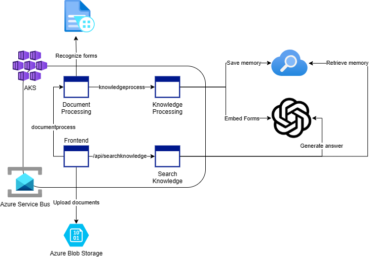

# Building Enterprise Apps powered by AI with Semantic Kernel

This sample demonstrates a few approaches for creating ChatGPT-like experiences over your own data using the Retrieval Augmented Generation pattern. It uses Azure OpenAI Service to access the ChatGPT model (`gpt-35-turbo`), and Azure Cognitive Search for data indexing and retrieval.

The repo includes sample data so it's ready to try end-to-end. In this sample application, we use a fictitious company called Contoso Electronics, and the experience allows its employees to ask questions about the benefits, internal policies, as well as job descriptions and roles.

## Features

* Upload Documents
* Search Documents

## Resources

* [Revolutionize your Enterprise Data with ChatGPT: Next-gen Apps w/ Azure OpenAI and Cognitive Search](https://aka.ms/entgptsearchblog)
* [Azure Cognitive Search](https://learn.microsoft.com/azure/search/search-what-is-azure-search)
* [Azure OpenAI Service](https://learn.microsoft.com/azure/cognitive-services/openai/overview)
* [`Azure.AI.OpenAI` NuGet package](https://www.nuget.org/packages/Azure.AI.OpenAI)

> **Note** 
> The PDF documents used in this demo contain information generated using a language model (Azure OpenAI Service). The information contained in these documents is only for demonstration purposes and does not reflect the opinions or beliefs of Microsoft. Microsoft makes no representations or warranties of any kind, express or implied, about the completeness, accuracy, reliability, suitability or availability with respect to the information contained in this document. All rights reserved to Microsoft.

### FAQ

***Question***: Why do we need to break up the PDFs into chunks when Azure Cognitive Search supports searching large documents?

***Answer***: Chunking allows us to limit the amount of information we send to OpenAI due to token limits. By breaking up the content, it allows us to easily find potential chunks of text that we can inject into OpenAI.
